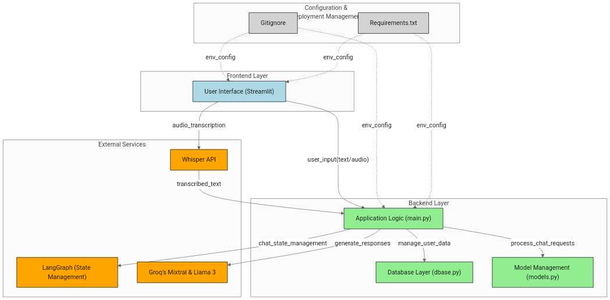

# Gamma-o1-chatBot
Gamma-o1-chatBot is an AI-powered chatbot that offers dynamic and engaging interactions with users. Built using **Streamlit**, **MongoDB**, and **LangChain**, this chatbot supports multiple AI personalities, chat history, and session title generation. It leverages **Groq's LLM API** and **OpenAI** models for intelligent conversations.

🌐 **Live Demo**: [Try Gamma-o1-chatBot here](https://gamma-chat-1.streamlit.app/)

---

## 🚀 Features

- 🔹 **Multiple AI Personalities** – Users can choose from different AI personas such as Professor AI, Comedian Bot, Motivator AI, and more.
- 🔹 **Persistent Chat History** – Saves user conversations and session titles in MongoDB.
- 🔹 **Custom AI Models** – Supports various Groq models like **Mixtral-8x7b-32768** and **Llama-3.3-70b-specdec**.
- 🔹 **Speech-to-Text Transcription** – Converts voice messages into text using Whisper API.
- 🔹 **Dynamic Session Title Generation** – Automatically summarizes conversations into meaningful session titles.
- 🔹 **Streamlit UI with Sidebar & Floating Chat Input** – Intuitive web-based user interface.

---


## 🚀 Architecture

---


## 📌 Tech Stack

- **Frontend**: Streamlit, Streamlit Chat Widget, Streamlit Float
- **Backend**: Python, LangChain, MongoDB, Groq API, OpenAI API
- **Database**: MongoDB (via `pymongo`)
- **LLMs Used**: Groq Mixtral, Llama-3.3
- **Authentication**: User authentication with MongoDB

---

## 📂 Project Structure

```
📦 Gamma-o1-chatBot
 ┣ 📜 main.py             # Streamlit app & chatbot logic
 ┣ 📜 models.py           # Schema definitions for MongoDB
 ┣ 📜 dbase.py            # Database connection & collections
 ┣ 📜 requirements.txt    # List of dependencies
```

---

## 🔧 Installation & Setup

### Prerequisites
- Python 3.10+
- MongoDB (Cloud or Local Instance)
- Groq & OpenAI API Keys

### 1️⃣ Clone the Repository
```bash
git clone https://github.com/davidajimati/gamma-chat-o1
cd Gamma-o1-chatBot
```

### 2️⃣ Create a Virtual Environment & Install Dependencies
```bash
python -m venv venv
source venv/bin/activate  # For macOS/Linux
venv\Scripts\activate     # For Windows
pip install -r requirements.txt
```

### 3️⃣ Configure Secrets
Create a `.streamlit/secrets.toml` file and add your MongoDB and API credentials:
```toml
MONGO_URI = "your_mongodb_connection_string"
GROQ_API_KEY = "your_groq_api_key"
OPENAI_API_KEY = "your_openai_api_key"
```

### 4️⃣ Run the Application
```bash
streamlit run main.py
```

---

## 🛠 Usage

1️⃣ **Start the chatbot** by entering your username.
2️⃣ **Choose an AI model** from the sidebar.
3️⃣ **Select an AI character** to personalize responses.
4️⃣ **Chat with the AI** using text or voice messages.
5️⃣ **View chat history** and session titles in the sidebar.

---

## 📖 API Endpoints
This chatbot uses Groq API for generating responses and Whisper API for speech-to-text transcription.

### 1️⃣ Chat Completion
- **Endpoint:** `client.chat.completions.create()`
- **Model:** `mixtral-8x7b-32768`, `llama-3.3-70b-specdec`

### 2️⃣ Speech-to-Text Transcription
- **Function:** `transcribe_audio(audio_file)`
- **Model:** `whisper-large-v3-turbo`

---

## 🎯 Future Enhancements
- ✅ Support for OpenAI GPT models
- ✅ Implement user authentication
- ✅ Improve UI/UX with better chat display
- ✅ Add more AI personalities & customization
- ✅ Enhance database optimization & indexing

---

## 👥 Project Team & Responsibilities

- **@David Ajimati** - Project setup and Initialization
- **@Abiodun Odukaye** - Database and message persistence
- **@Uche Madu & @Paul Obiahu** - Integrate Groq with LangChain
- **@Uche Madu & @David Ajimati** - Implement Character Selection
- **@David Edoh & @Esther Timothy** - Integrate chatbot into Streamlit app
- **@Paul Obiahu and @Abiodun Odukaye** - Deploy and test chatbot
- **@Augustine Chibueze** - documentation report

---

💡 Feel free to contribute, suggest features, or report issues!


README.md
5 KB